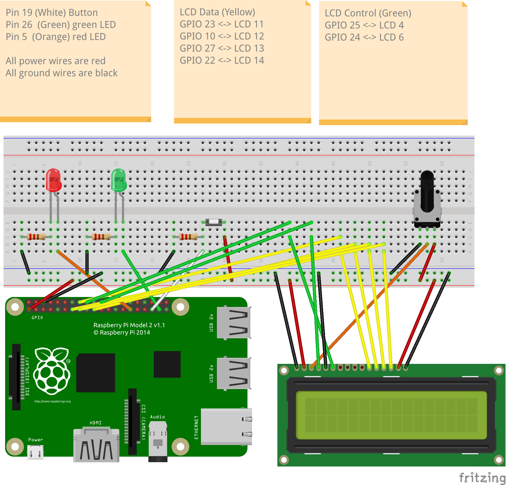

# f28hs-2024-25-cwk2-sys

Coursework 2 in F28HS "Hardware-Software Interface" on Systems Programming in C and ARM Assembler

The [CW specification is here](http://www.macs.hw.ac.uk/~hwloidl/Courses/F28HS/Coursework_F28HS_CW2_2025.pdf)

Use Canvas groups (People -> Groups) to **sign-up as a pair** for this pair project.

Links:
- You can use any machine with an installation of the `gcc` C compiler for running the C code of the game logic
- Template for the C program: [master-mind.c](master-mind.c)
- Template for the ARM Assembler program: [mm-matches.s](mm-matches.s)

## Contents

This folder contains the following CW2 specification template files for the source code and for the report:
- `master-mind.c` ... the main C program for the CW implementation, and most aux fcts
- `mm-matches.s`  ... the matching function, implemented in ARM Assembler
- `lcdBinary.c`   ... the low-level code for hardware interaction with LED, button, and LCD;
                      this should be implemented in inline Assembler; 
- `testm.c`       ... a testing function to test C vs Assembler implementations of the matching function
- `test.sh`       ... a script for unit testing the matching function, using the -u option of the main prg

## Gitlab usage

**Fork** and **Clone** this gitlab repo to get started on the coursework.

Complete the functions in `master-mind.c` and in `lcdBinary.c`. Initially, you can implement these as C
functions. However, for the final implementation, the low-level functions for controlling LED, button, and
LCD display should be implemented in inline Assembler (in `lcdBinary.c`). Note that the **matching function**,
for calculating the number of exact and approximate matches also needs to be implemented in ARM Assembler.
The file `mm-matches.s` contains a template this Assembler code.

You can test basic functionality by using the `testm.c` C function and the `test.sh` shell script (see below).

**Push** to the repo and ask questions in the comments box to get help.

## Building and running the application

You can build the main C program (in `master-mind.c`), and the `testm.c` testing function, by typing
> make all

and run the Master Mind program in debug mode by typing
> make run

and do unit testing on the matching function
> make unit

or alternatively check C vs Assembler version of the matching function
> make test

For the Assembler part, you need to edit the `mm-matches.s` file, compile and test this version on the Raspberry Pi.
See the test input data in the `secret` and `guess` structures at the end of the file, for testing.

After having tested the components separately, integrate both so that the C program (in `master-mind.c`)
calls the ARM Assembler code (in `mm-matches.s`) for the matching function.
For controlling the external devices of LED, LCD and button use inline Assembler code, as discussed in
the matching lecture in the course.

The final version of the code should be pushed to this repo, and also submitted through Canvas, together with the report and video.

A test script is available to do unit-testing of the matching function. Run it like this from the command line
> sh ./test.sh

To test whether all tests have been successful you can do
> echo $?

which should print `0`.

If you picked up the `.gitlab-ci.yml` file in this repo, this test will be done automatically when uploading the file and you will get either a Pass or Fail in the CI section of the gitlab-student server.

## Unit testing

This is an example of doing unit-testing on 2 sequences (C part only):
```
> ./cw2 -u 121 313
0 exact matches
1 approximate matches
```

The general format for the command line is as follows (see template code in `master-mind.c` for processing command line options):
```
./cw2 [-v] [-d] [-s] <secret sequence> [-u <sequence1> <sequence2>]
```

## Wiring

A **green LED**, as output device, should be connected to the RPi2 using **GPIO pin 26.**

A **red LED**, as output device, should be connected to the RPi2 using **GPIO pin 5.**

A **Button**, as input device, should be connected to the RPi2 using **GPIO pin 19.**

An **LCD display**, with a potentiometer to control contrast, should be wired to the
Raspberry by as shown in the Fritzing diagram below.

You will need resistors to control the current to the LED and from the Button. You
will also need a potentiometer to control the contrast of the LCD display.

The Fritzing diagram below visualises this wiring. 


